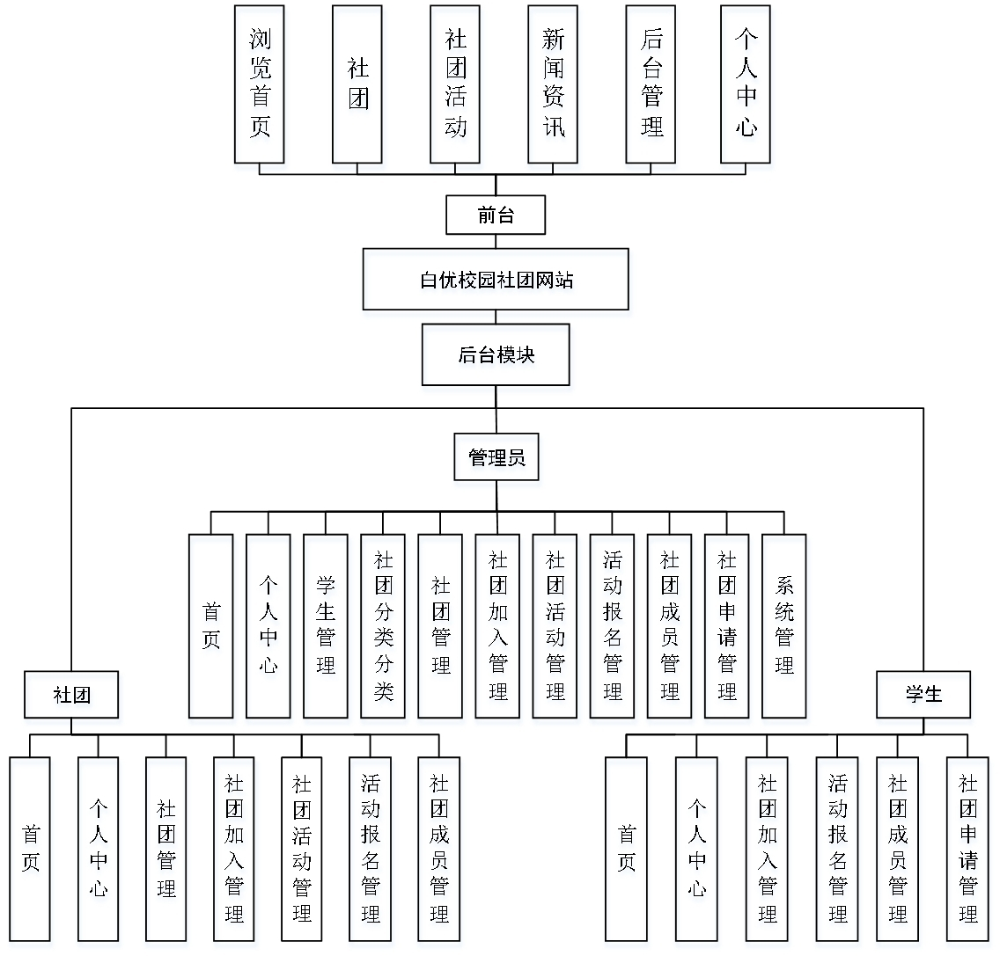
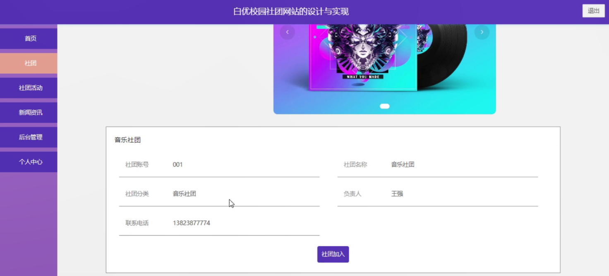
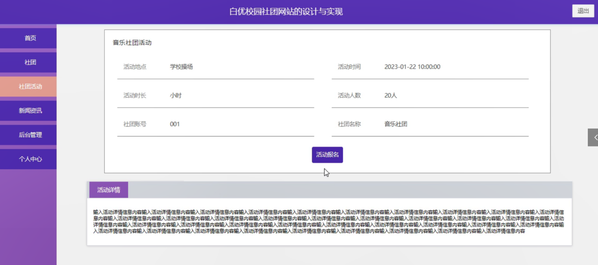
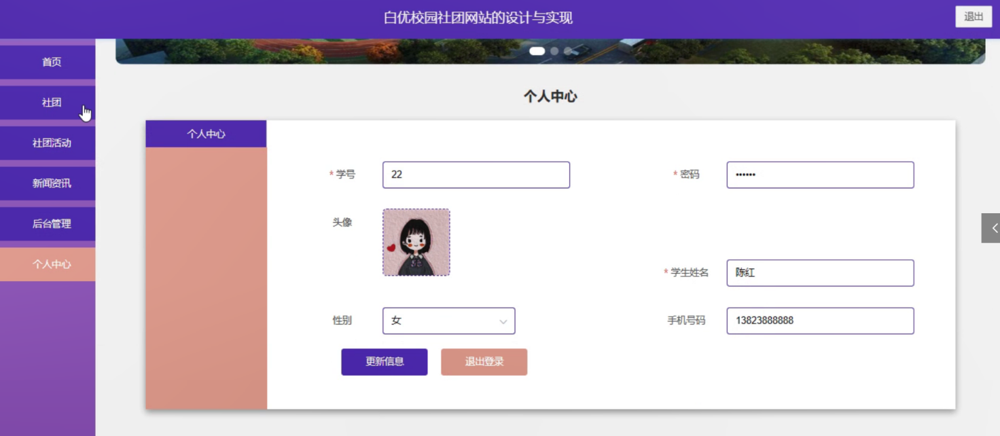
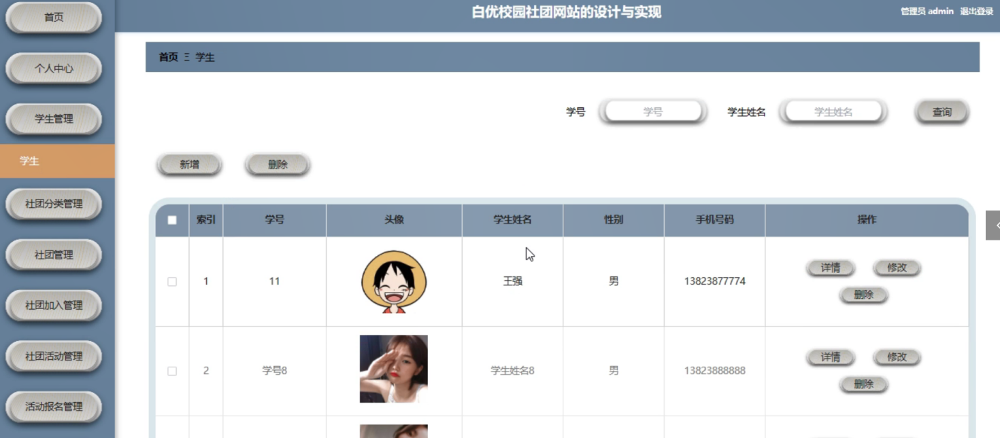
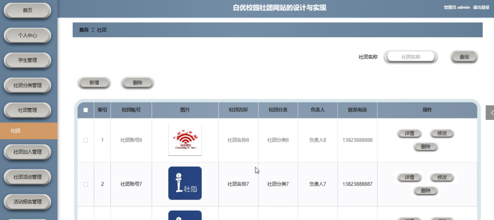
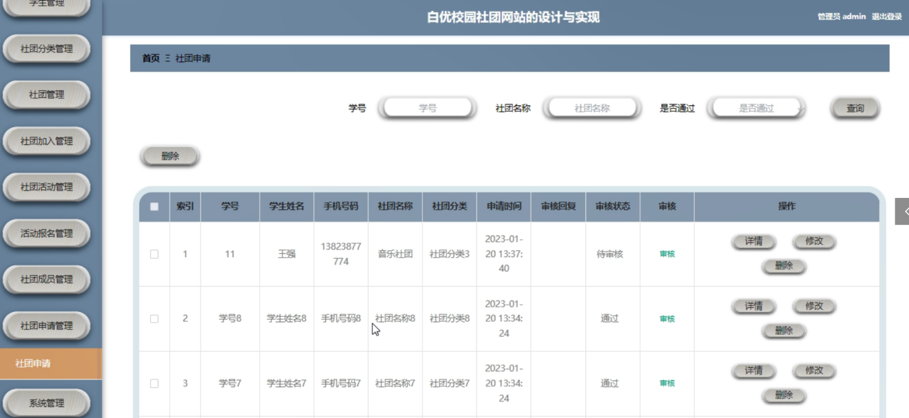
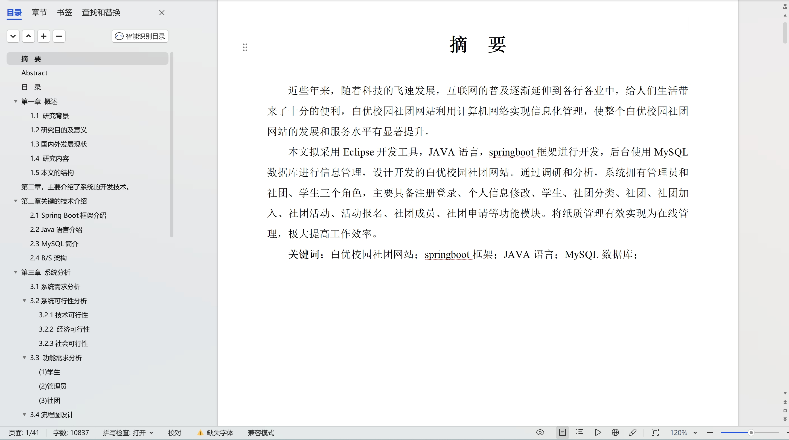

 
## 查看主页获取源码

> **作者介绍**： **✌**全网粉丝10W+本平台特邀作者、博客专家、CSDN新星计划导师、java领域优质创作者,博客之星、掘金/华为云/阿里云/InfoQ等平台优质作者、专注于项目实战 **✌**

  

### 一、作品包含

源码+数据库+设计文档万字+PPT+全套环境和工具资源+部署教程

### 二、项目技术

前端技术：Html、Css、Js、Vue、Element-ui

数据库：MySQL

后端技术：Java、Spring Boot、MyBatis

  

### 三、运行环境

开发工具：IDEA/eclipse

数据库：MySQL5.7

数据库管理工具：Navicat10以上版本

环境配置软件： JDK1.8+Maven3.6.3

前端Nodejs：14

### 四、项目介绍
项目编号：springbootA081

近些年来，随着科技的飞速发展，互联网的普及逐渐延伸到各行各业中，给人们生活带来了十分的便利，白优校园社团网站利用计算机网络实现信息化管理，使整个白优校园社团网站的发展和服务水平有显著提升。
JAVA语言，springboot框架进行开发，后台使用MySQL数据库进行信息管理，设计开发的白优校园社团网站。通过调研和分析，系统拥有管理员和社团、学生三个角色，主要具备注册登录、个人信息修改、学生、社团分类、社团、社团加入、社团活动、活动报名、社团成员、社团申请等功能模块。将纸质管理有效实现为在线管理，极大提高工作效率。

### 五、运行截图

  
